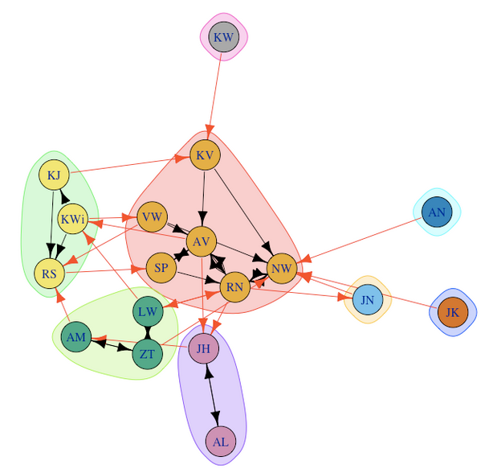
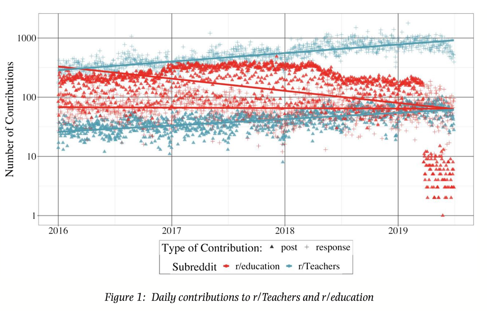
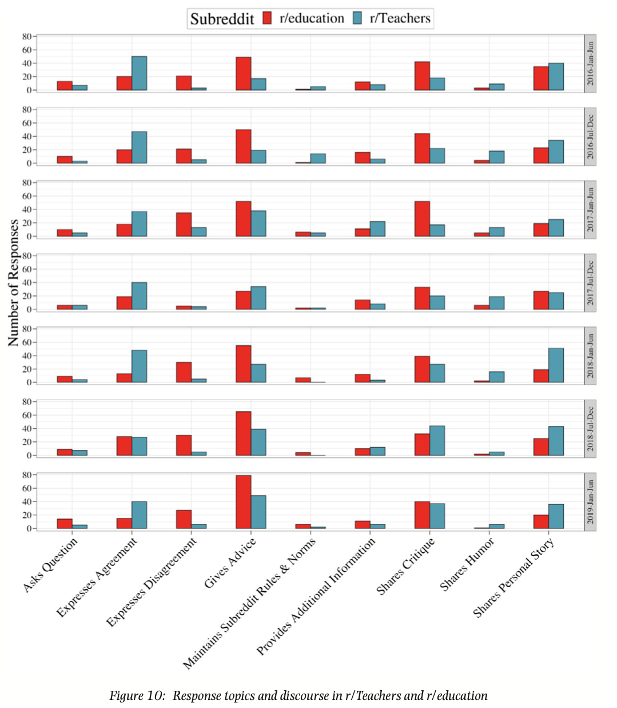

```{r setup, include=FALSE}
usethis::use_git_ignore(c("*.csv", "*.rds"))
options(htmltools.dir.version = FALSE)

library(knitr)
library(tidyverse)
library(xaringan)
library(fontawesome)
```

class: inverse, center, middle

**View the slides:** 

[bretsw.github.io/eme6356-ss22-module1](https://bretsw.github.io/eme6356-ss22-module1)

---

class: inverse, center, middle

# Welcome to EME6356!

---

class: inverse, center, middle

# Say hi

```{r, out.width = "720px", echo = FALSE, fig.align = "center"}
include_graphics("img/mask.jpg")
```

#

#

# if you're interested in applying analytics in...

---

class: inverse, center, middle

# K-12 schools

---

class: inverse, center, middle

# Higher education

---

class: inverse, center, middle

# Military

---

class: inverse, center, middle

# Healthcare and wellness

---

class: inverse, center, middle

# Business

---

class: inverse, center, middle

# Keep connecting!

```{r, out.width = "720px", echo = FALSE, fig.align = "center"}
include_graphics("img/mask.jpg")
```

---

class: inverse, center, middle

# What is "analytics"?

---

class: inverse, center, middle

# What is "analytics"?

**The first thing that comes to mind when I think about learning analytics is...**

<div class="padlet-embed" style="border:1px solid rgba(0,0,0,0.1);border-radius:2px;box-sizing:border-box;overflow:hidden;position:relative;width:100%;background:#F4F4F4"><p style="padding:0;margin:0"><iframe src="https://fsu.padlet.org/embed/76eouyx89d2esz1r" frameborder="0" allow="camera;microphone;geolocation" style="width:100%;height:420px;display:block;padding:0;margin:0"></iframe></p><div style="padding:8px;text-align:right;margin:0;"><a href="https://padlet.com?ref=embed" style="padding:0;margin:0;border:none;display:block;line-height:1;height:16px" target="_blank"></a></div></div>

---

class: inverse, center, middle

# A sink full of dishes...

---

# Great British Bake Off

```{r, out.width = "840px", echo = FALSE, fig.align = "center"}
include_graphics("img/baking.jpg")
```

---

# Choices of ingredients

```{r, out.width = "840px", echo = FALSE, fig.align = "center"}
include_graphics("img/ingredients.jpg")
```

---

# A sink full of dishes...

```{r, out.width = "840px", echo = FALSE, fig.align = "center"}
include_graphics("img/sink.jpg")
```

---

class: inverse, center, middle

# A sink full of dishes...

**What analytics stories can a sink tell?**

<div class="padlet-embed" style="border:1px solid rgba(0,0,0,0.1);border-radius:2px;box-sizing:border-box;overflow:hidden;position:relative;width:100%;background:#F4F4F4"><p style="padding:0;margin:0"><iframe src="https://fsu.padlet.org/embed/2nujhz09bjxqfqkb" frameborder="0" allow="camera;microphone;geolocation" style="width:100%;height:420px;display:block;padding:0;margin:0"></iframe></p><div style="padding:8px;text-align:right;margin:0;"><a href="https://padlet.com?ref=embed" style="padding:0;margin:0;border:none;display:block;line-height:1;height:16px" target="_blank"></a></div></div>

---

class: inverse, center, middle

# Defining "Analytics"

---

# Defining *learning analytics*

--

- Measurement

--

- Collection

--

- Analysis

--

- Reporting

--

...of data about learners and their contexts, 

--

for purposes of understanding and optimising learning and the environments in which it occurs.

--

<div class="caption">
<p><a href="https://www.solaresearch.org/about/what-is-learning-analytics/" target="_blank">Society for Learning Analytics Research (SoLAR)</a></p>
</div>

---

# Working definition of *analytics*

```{r, out.width = "560px", echo = FALSE, fig.align = "center"}
include_graphics("img/puzzle-gap.jpg")
```

--

**Purpose:** measuring, collecting, analyzing, reporting... lots of data

--

**Trade-offs:** different than working "by hand" but can include both quantitative and qualitative data

--

**Situated identity:** who is a data scientist?

---

class: inverse, center, middle

# Quick examples of analytics


---

# Star Wars

```{r, echo = TRUE}
library(tidyverse)
starwars
```

---

# Star Wars

```{r, echo = TRUE}
library(tidyverse)
starwars %>% 
  unnest(starships) %>% 
  select(name, gender, starships) %>%
  head(16)
```

---

# Star Wars

```{r, echo = TRUE}
library(tidyverse)
starwars %>% 
  unnest(starships) %>% 
  mutate(vehicles = strsplit(starships, ",")) %>%
  unnest(starships) %>% 
  select(name, gender, starships) %>% 
  group_by(gender) %>% 
  count()
```

---

# LMS logins

```{r, out.width = "100%", echo = FALSE, fig.align = "center"}
include_graphics("img/1-lms-logins.png")
```

---

# Class conversation patterns

```{r, out.width = "560px", echo = FALSE, fig.align = "center"}

```

---

# Reddit frequencies

```{r, out.width = "720px", echo = FALSE, fig.align = "center"}

```

<div class="caption">
<p>
Staudt Willet, K. B., & Carpenter, J. P. (2021). A tale of two subreddits: Change and continuity in teaching-related online spaces. <em>British Journal of Educational Technology, 52</em>(2), 714-733. <a href="https://doi.org/10.1111/bjet.13051" target="_blank">doi:10.1111/bjet.13051</a>
</p>
</div>

---

# Reddit topics

```{r, out.width = "480px", echo = FALSE, fig.align = "center"}

```

---

# Twitter \#Edchat topics

```{r, out.width = "720px", echo = FALSE, fig.align = "center"}
include_graphics("img/1-twitter-topics.png")
```

---

class: inverse, center, middle

# What is "analytics" *not*?

---

# Analytics is not...

```{r, out.width = "560px", echo = FALSE, fig.align = "center"}

```

--

- magic

--

- a substitute teacher

--

- a test proctor

--

- oil

---

# Module 1 readings

```{r, out.width = "360px", echo = FALSE, fig.align = "center"}
include_graphics("img/books.jpg")
```

--

- 1.1 Educational Research: The Hardest Science of All (Berliner, 2002)

--

- 1.2 Odds Are, It’s Wrong (Siegfried, 2010)

--

- 1.3 “The Numbers Speak for Themselves:” Data Use and the Organization of Schooling in Two Florida Elementary Schools (Rutledge & Neal, 2013)

--

- 1.4 Big Data Analytics (Russom, 2011)

--

- 1.5 Data Science and Its Relationship to Big Data and Data-Driven Decision Making (Provost & Fawcett, 2013)

---

class: inverse, center, middle

# What do *you* want to do with analytics?

<div class="padlet-embed" style="border:1px solid rgba(0,0,0,0.1);border-radius:2px;box-sizing:border-box;overflow:hidden;position:relative;width:100%;background:#F4F4F4"><p style="padding:0;margin:0"><iframe src="https://fsu.padlet.org/embed/xqug6vu51yfxwrc5" frameborder="0" allow="camera;microphone;geolocation" style="width:100%;height:420px;display:block;padding:0;margin:0"></iframe></p><div style="padding:8px;text-align:right;margin:0;"><a href="https://padlet.com?ref=embed" style="padding:0;margin:0;border:none;display:block;line-height:1;height:16px" target="_blank"></a></div></div>

---

class: inverse, center, middle

# Looking ahead

---

# Semester schedule

--

- **Module 1:** Intro to Analytics

--

- **Module 2:** Performance Analytics

--

- **Module 3:** Learning Analytics

--

- **Module 4:** Web Analytics

--

- **Module 5:** Data Visualization

--

- **Module 6:** Ethics in Learning Analytics

--

- **Module 7:** Future of Analytics

--

- **Module 8:** Case Discussions

---

# Module structure

```{r, out.width = "480px", echo = FALSE, fig.align = "center"}
include_graphics("img/workshop.jpg")
```

--

- `r fa("video", fill = "#782F40")` Meet (Tuesdays at 8pm EST on Zoom)

--

- `r fa("compass", fill = "#782F40")` Explore

--

- `r fa("book-open", fill = "#782F40")` Read

--

- `r fa("comments", fill = "#782F40")` Discuss (Flipgrid or VoiceThread)

--

- `r fa("user-edit", fill = "#782F40")` Create

---

# Major Assignments

```{r, out.width = "480px", echo = FALSE, fig.align = "center"}
include_graphics("img/build.jpg")
```

--

### Discussion (40%)

--

- Flipgrid (4 x 50 points)

--

- VoiceThread (4 x 50 points)

---

# Major Assignments

```{r, out.width = "480px", echo = FALSE, fig.align = "center"}
include_graphics("img/build.jpg")
```

### Analytics Assignments (60%)

--

- Analytics Problem Plan (100 points)

--

- Analytics Practice (200 points)

--

- Analytics Case Presentation (200 points; group project)

--

- Analytics Ethics Statement (100 points)

---

class: inverse, center, middle

# Questions?

```{r, out.width = "480px", echo = FALSE, fig.align = "center"}
include_graphics("img/question.jpg")
```

**What questions can I answer for you now?**

**How can I support you this week?**

<hr>

`r fa("envelope", fill = "white")` [bret.staudtwillet@fsu.edu](mailto:bret.staudtwillet@fsu.edu) | `r fa("twitter", fill = "white")` [@bretsw](https://twitter.com/bretsw) | `r fa("globe", fill = "white")` [bretsw.com](http://bretsw.com)